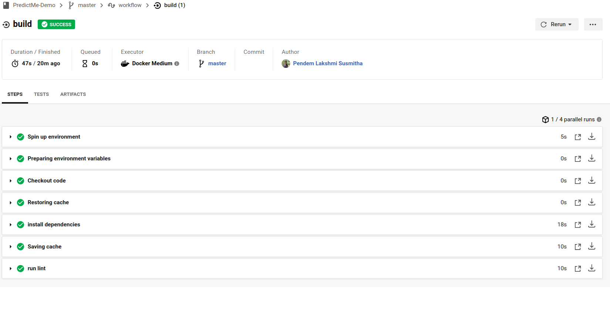

# PredictMe
[](https://circleci.com/gh/Susmitha5c3/PredictMe-Demo)

I chose a pre-trained, sklearn model that has been trained to predict housing prices in Boston according to several features, such as average rooms in a home and data about highway access, teacher-to-pupil ratios, and so on. The datah was initially taken from Kaggle, on the data source site. This project is to operationalize a Python flask app— [app.py](./app.py), that serves out predictions (inference) about housing prices through API calls. This project could be extended to any pre-trained machine learning model, such as those for image recognition and data labeling.

## Environment Setup

1. Install **Pip3** and **Python3**
2. Run **MakeFile** to install all necessary python packages.
``` bash
make install
```
3. Install other libraries
    * Docker
    > Create a [Docker account](https://hub.docker.com/signup) with **unique Docker ID as username**  

    > Install docker from [Docker's Offical page](https://docs.docker.com/get-docker/)
    * Kubernets (Minikube)
    > Install [brew](https://brew.sh/)

    > Install **VirtualBox**
    ```bash
    brew cask install virtualbox
    ```
    > Install **Minikube**
    ```bash
    brew cask install minikube
    ```
    * Hadolint
    > Install **hadolint**
    ```bash
    brew install hadolint 
    ```
    > Run make lint to check lint errors
    ```bash
    make lint
    ``` 
    > Output
    ```bash
    ------------------------------------
    Your code has been rated at 10.00/10
    ``` 

## Project Tasks
1. Docker
    > Create a Dockerfile which includes
    * Step 1 : Create a working directory
    * Step 2 : Copy source directory **app.py** to this working directory
    * Step 3 : Run Lint
    * Step 4 : Expose on port 80
    * Step 5 : Run the command **python app.py** 

    > Run the dockerfile **run_docker.sh**
    * step 1 : Build a docker python image 
    * Step 2 : Run the flask app on docker image

    > Run the **make_predictions.sh** to see the output of the predictions in json format. 

    > Output 
    ```bash 
    [2020-05-19 14:16:43,961] INFO in app: JSON payload: 
    {'CHAS': {'0': 0}, 'RM': {'0': 6.575}, 'TAX': {'0': 296.0}, 'PTRATIO': {'0': 15.3}, 'B': {'0': 396.9}, 'LSTAT': {'0': 4.98}}
    [2020-05-19 14:16:43,977] INFO in app: Inference payload DataFrame: 
    CHAS     RM    TAX  PTRATIO      B  LSTAT
    0     0  6.575  296.0     15.3  396.9   4.98
    [2020-05-19 14:16:43,989] INFO in app: Scaling Payload: 
    CHAS     RM    TAX  PTRATIO      B  LSTAT
    0     0  6.575  296.0     15.3  396.9   4.98
    [2020-05-19 14:16:43,993] INFO in app: PREDICTION: [20.35373177134412]
    172.17.0.1 - - [19/May/2020 14:16:43] "POST /predict HTTP/1.1" 200 -
    ```
    > To save the log output, copy the terminal output into **docker_output.txt** file.

    > Upload the Docker Image through **upload_docker.sh**
    * Step 1 : Create a Docker Hub path variable
    * Step 2 : Authenticate and login 
    * Step 3 : Push Image to Dcoker repo

    > Run
    ```bash
    ./upload_docker.sh
    ```
2. Kubernets
    > Start the minikube server
    ```bash
    minikube start
    ```
    > Create a **run_kubernets.sh** file which is same as docker.
    * Step 1 : Create a Docker path variable
    * Step 2 : Run Docker hub container with kubernets
    * Step 3 : List all the pods after running
    * Step 4 : Forward the container to port 80

    > Run the **make_predictions.sh** in another terminal
    
    > Output
    ```bash
    NAME             READY   STATUS    RESTARTS   AGE
    udacityproject   1/1     Running   1          88m
    Forwarding from 127.0.0.1:8000 -> 80
    Forwarding from [::1]:8000 -> 80
    Handling connection for 8000
    ```

    > **Important** Delete the kubenets cluster 
    ```bash
    minikube delete
    ```
    > For later use you can stop the cluster
    ```bash
    minikube stop
    ```

3. CircleCi Integeration
    > Create .circleci/config.yml. Copy the contents for [config.yml](./.circleci/config.yml). Push the entire content to the github. 

    > Create [**CircleCi** account](https://circleci.com/signup/) through github

    > Select your organization and start building the repo you have created

    > After successfull building you can see the passed badge

    